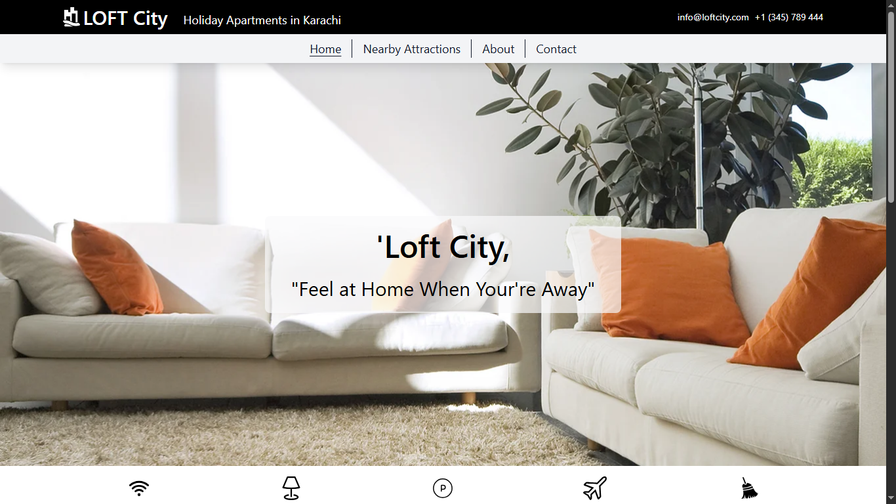

# Loft City

**Loft City** is a responsive, React-based front-end project designed for vacation rental companies. It showcases property listings in an elegant, mobile-friendly format.

## Live Preview



##  Live Demo

Check out the live version here:  
[loftcity.netlify.app](https://loftcity.netlify.app)

##  Features

- **Responsive UI**: Optimized for both desktop and mobile browsing.
- **Property Listings**: Showcases rentals using image-rich, user-friendly cards.
- **Reusable Components**: Built with modular React components for scalability.
- **Modern Design**: Focused on clean visuals and simple user experience.

##  Tech Stack

| Technology     | Purpose                          |
|----------------|----------------------------------|
| React          | Front-end framework              |
| Tailwind CSS   | Styling and responsive design    |
| Netlify        | Deployment platform              |

*(Optional: Add more such as React Router, Axios, or whether you’re using a headless CMS, data mock APIs, etc.)*

##  Installation & Development

1. Clone the repo:  
   ```bash
   git clone https://github.com/sheikh92areeb/loft-city.git
   cd loft-city/react
   ```

2. Install dependencies:
   ```
   Install dependencies:
   ```
3. Start the development server:
  ```
  npm run dev
  ```
4. Open to see your app.

## Usage

- Navigate the property listings on both desktop and mobile.
- Click on individual property cards (if implemented) for more detail.
- (Optionally) Use filters or search—add usage instructions if these features exist.

## Contributing

Contributions are welcome! If you’d like to help improve Loft City with new features, bug fixes, or enhancements, feel free to open a pull request or reach out directly.

## License

This project is open-source and licensed under the MIT License. See [LICENSE](LICENSE) for details.

## Contact

Created by Areeb Sheikh.
Feel free to contact me via [GitHub](https://github.com/sheikh92areeb) or [LinkedIn](https://www.linkedin.com/in/areeb-sheikh18/) for inquiries, feedback, or collaboration!
